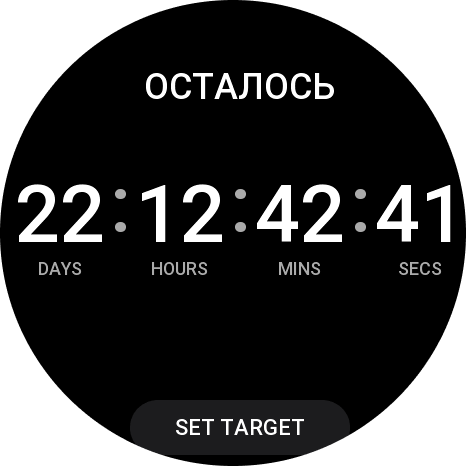
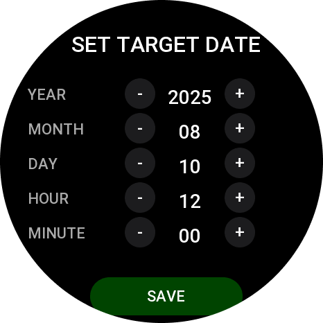

# Countdown App для Zepp OS

Современное и настраиваемое приложение обратного отсчета для умных часов на базе Zepp OS. Позволяет отслеживать время до любого важного события.


## 🖼️ Скриншоты

| Главный экран | Экран настроек |
| :---: | :---: |
| ** | ** |

## ✨ Возможности

- **Точный обратный отсчет**: Отсчитывает дни, часы, минуты и секунды до указанной даты.
- **Современный дизайн**: Чистый и минималистичный интерфейс с белыми цифрами на черном фоне.
- **Настраиваемая дата**: Легко установите любую целевую дату и время через интуитивное меню настроек.
- **Сохранение состояния**: Приложение запоминает установленную дату даже после закрытия.
- **Цветовая индикация**: Цифры меняют цвет на красный, когда до события остается менее 5 минут.
- **Open Source**: Проект полностью открыт для доработок и улучшений.

## 🛠️ Установка и настройка

### Требования

- [Zeus CLI](https://developer.zepp.com/docs/zeus/cli/) - инструмент для разработки под Zepp OS.
- Node.js (версия 14 или выше).

### Установка

1.  **Клонируйте репозиторий:**
    ```bash
    git clone https://github.com/your-username/countdown-app.git
    cd countdown-app
    ```

2.  **Установите зависимости:**
    ```bash
    npm install
    ```

## 🚀 Разработка

### Запуск в эмуляторе

Для запуска приложения в эмуляторе с автоматической перезагрузкой при изменениях в коде выполните:

```bash
zeus dev
```

### Запуск на реальном устройстве

1.  **Войдите в аккаунт разработчика:**
    ```bash
    zeus login
    ```

2.  **Запустите превью:**
    ```bash
    zeus preview
    ```

3.  **Отсканируйте QR-код** в приложении Zepp на вашем смартфоне, чтобы установить приложение на часы.

### Сборка проекта

Для сборки установочного пакета `.zab` выполните:

```bash
zeus build
```

Готовый файл будет находиться в папке `dist/`.

## 📂 Структура проекта

```
countdown-app/
├── LICENSE                # Файл лицензии MIT
├── app.js                 # Главный файл приложения
├── app.json               # Конфигурация приложения
├── package.json           # Зависимости и скрипты
├── README.md              # Документация
├── page/
│   └── index.js           # Код главного экрана (таймер)
└── setting/
    └── index.js           # Код экрана настроек
```

## 🤝 Участие в разработке

Мы приветствуем любой вклад в развитие проекта! Если у вас есть идеи по улучшению или вы нашли ошибку, пожалуйста, следуйте этим шагам:

1.  Сделайте форк репозитория.
2.  Создайте новую ветку (`git checkout -b feature/your-feature`).
3.  Внесите свои изменения.
4.  Создайте Pull Request.

## 📄 Лицензия

Этот проект распространяется под лицензией MIT. Подробности смотрите в файле [LICENSE](LICENSE).
